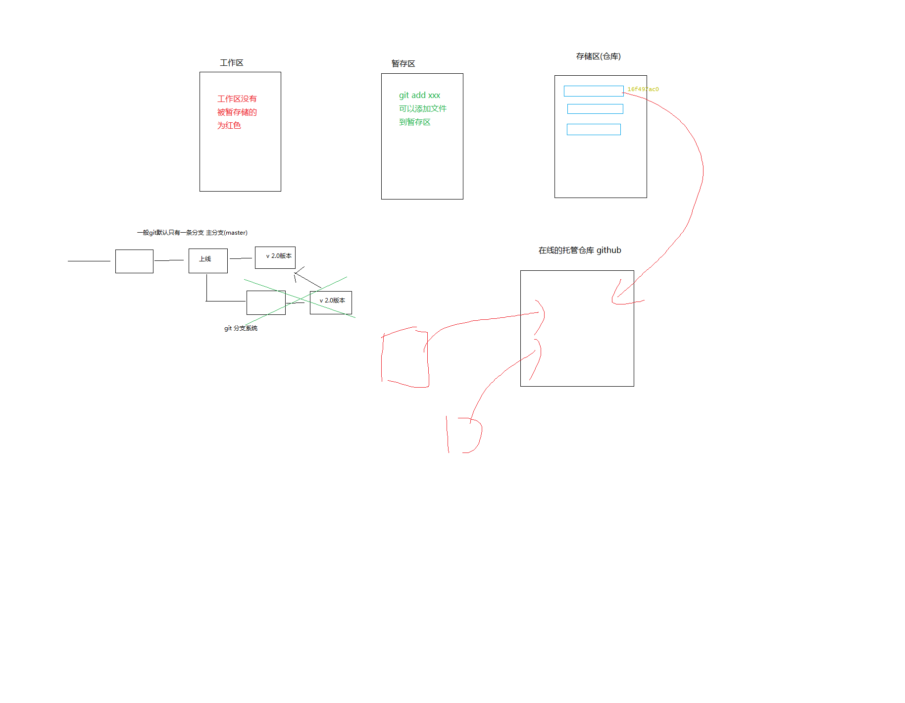

# 标题

## 标题

### 标题

#### 标题

##### 标题

###### 标题

> 每一个文本 要和 标记 用空格隔开
> 引用
> 和 html 当中的 h 标签类似

> -   -   -   都是列表标记

-   列表 1
-   列表 2
-   列表 3

1. 列表一
2. 列表 2

-   一级列表
    -   二级列表 1
    -   二级列表 2
-   一级列表 2
    -   二级列表 1

## 表格

| 属性     |  属性值  |       备注 |
| :------- | :------: | ---------: |
| 背景设置 |  url()   | 备注右对齐 |
| 字体     | 微软雅黑 |       备注 |
| 颜色     |  属红色  |       备注 |

## 图片

> 括号里边 图片路径 可以是相对路径也可以是网路路径 中括号就是 alt 属性



## 超链接

[百度](https://www.mi.com/)

## 代码块

```html
<style>
	.box {
		position: absolute;
		left: 50%;
		top: 50%;
		transform: translate(-50%, -50%);
	}
</style>
```

```css
.box {
	position: absolute;
	left: 50%;
	top: 50%;
	transform: translate(-50%, -50%);
}
```

## 行内代码

我是一个`<span></span>`

## 段落

我 IE 客服号弗利萨恢复的良好撒谎范德萨恢复到拉萨活动撒哈拉 j 在 Markdown 中段落由一行或者多

行文本组成，**相邻**的两行文字会被视为同一段落，如果存在空行则被视为*不同*段落( Markdown 对空行的定义是看~~起来~~是空行就是空行，即使空行中存在 空格 TAB 回车 等不可见字符，

同样会被视为空 Markdown 支持段内换行，如果你想进行段落内换行可以在上一行结尾

## 高级用法 参考 [马克飞象](https://maxiang.io/)

## 用什么来写 markdown 编辑工具

-   vscode
-   sublime
-   马克飞象

## 一些功能插件

-   Markdown Preview Enhanced
    -   可以进行格式转换
    -   输出成 html 文件
    -   输出成 pdf
    -   输出成 png

## 习惯用这个东西 写文档 做笔记
